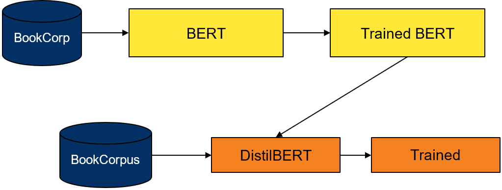
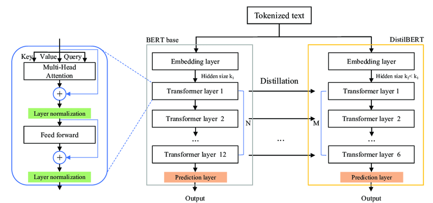
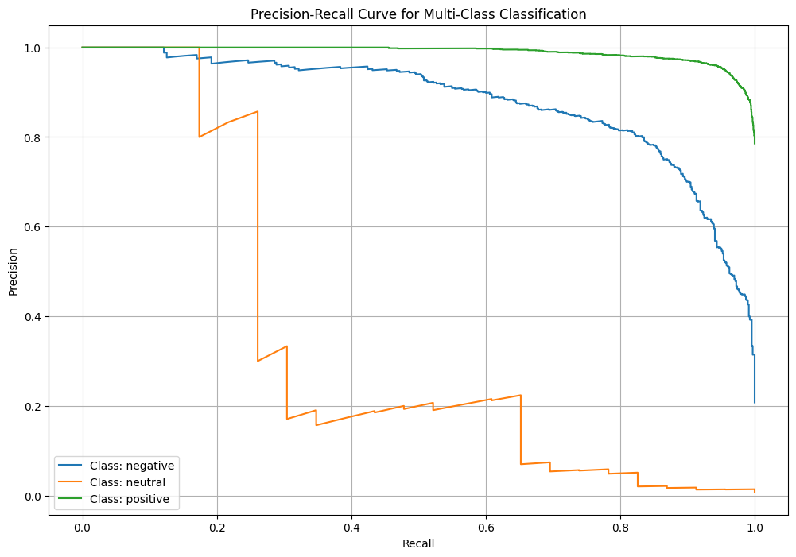
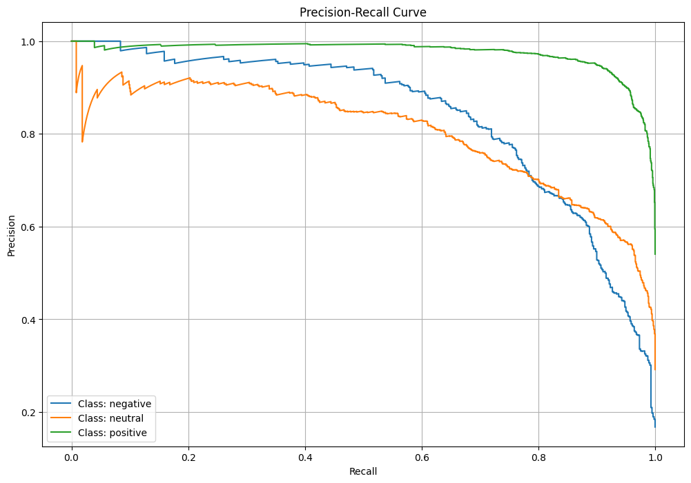

# Sentiment Analysis with DistilBERT

## Project Overview  
This project focuses on building a sentiment analysis model to predict the sentiment of customer reviews using **DistilBERT**. The pipeline involves scraping reviews, preprocessing the data, training a fine-tuned DistilBERT model, and deploying it through a Flask application. The workflow is automated using **Apache Airflow**.

---

## What is DistilBERT?

- DistilBERT is a smaller, faster, and more efficient version of BERT. It was developed through a process called knowledge distillation, where a smaller model (the student) is trained to reproduce the behavior of a larger model (the teacher) while retaining most of its performance. 
- DistilBERT retains 97% of BERT's performance on various NLP tasks while being 40% smaller and 60% faster.

  

- BERT consists of 12 transformer layers, an embedding layer and a prediction layer.
- During distillation, DistilBERT learns from BERT by mimicking its outputs (logits) and intermediate representations.
- As a resilt, DistilBERT has 6 transformer layers (half of BERT's 12 layers) while maintaining similar functionality.

  

---

## Features  
- **Data Collection**:  
  - Scraped 20,000+ Amazon reviews using **Selenium WebDriver**.  
  - Stored the collected data securely in an **AWS S3 bucket**.  

- **Data Preprocessing**:  
  - Cleaned and processed reviews and ratings:  
    - Removed non-English Reviews
    - Removed stopwords, special characters, and extra spaces.  
    - Performed lemmatization and stemming to normalize text.
    - Encoded ratings ranging from 0-5 stars to labels negative(0), neutral(1) and positive(2)  
  - Stored the processed data in **S3** for further use.  

- **Data Tokenization and Preparation**:  
  - Tokenized reviews using **DistilBERT tokenizer**.  
  - Divided the dataset into **training**, **validation**, and **testing** sets.

- **Model Training**:  
  - Imported **DistilBERT** from **Hugging Face Transformers**.  
  - Fine-tuned the model on the dataset.  
  - Implemented **early stopping** to optimize training.  
  - Used **customized class weights** to handle class imbalance in training dataset.

- **Deployment**:  
  - Built a user-friendly **Flask application** for making predictions.
    

- **Workflow Automation**:  
  - Integrated **Apache Airflow** to automate the entire pipeline. 
    

---

## Result

- **Accuracy**: Achieved an accuracy of 85% on the test dataset.
- **F1-score**: Achieved f1-scores of 0.9 for positive class and 0.7 for others on the test dataset.
- Enhanced multi-class classification performance by implementing class-weighted training, improving the Precision-Recall AUC for minority classes (e.g., 'neutral') by over 30%, resulting in more balanced and accurate predictions across all categories
  - Before: 
    
  - After class-weighted training:
    

## Getting Started  

To get started with this project, follow these steps:

1. Clone the repository:  
   ```bash
   git clone https://github.com/SathvikNayak123/sentiment-anyalysis
   ```
2. Install the necessary dependencies:
    ```bash
    pip install -r requirements.txt
    ```
3. Add AWS S3 credentials in .env file

4. Run Airflow to execute scraping and training pipeline:
    ```bash
    astro dev init
    astro dev start

5. Run app for prediction
    ```bash
    python app.py
    ```
